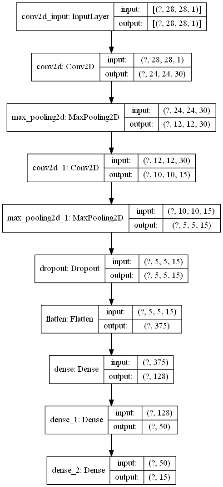
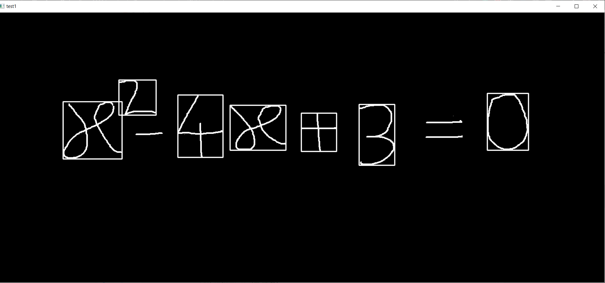
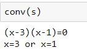

# Handwritten_equation_solverCNN

Equation solver can solve quadratic equation. It is based on CNN model. 

1. [Description](#description)
2. [Requirements](#requirements)
3. [Library](#library)
4. [Steps](#steps)
5. [Conclusion](#conclusion)
6. [Reference](#Reference)

## Description
Equation solver use the contour feature of OpenCV for detection of digits and mathematical symbols like +,-,X and divide etc. 
I used maths symbol data set from kaggle. https://www.kaggle.com/xainano/handwrittenmathsymbols  
For making this project I refer this repository https://github.com/vipul79321/Handwritten-Equation-Solver  
## Dataset Description
Dataset consists of jpg files(45x45) 
DISCLAIMER: dataset does not contain Hebrew alphabet at all. It includes basic Greek alphabet symbols like: alpha, beta, gamma, mu, sigma, phi and theta. 
English alphanumeric symbols are included. 
All math operators, set operators. 
Basic pre-defined math functions like: log, lim, cos, sin, tan. 
Math symbols like: \int, \sum, \sqrt, \delta and more. 
I am using only digits and +,-,times,/ and X(x in algebra) folders for input. These folder contains jpg files(45x45). But our model requires 28X28 images  

## CNN Model diagram

## Requirements
1.Python 3.6
2.Machine Learning library : OpenCV

## Library

## OpenCV

OpenCV is an open source computer vision and machine learning software library. It is a BSD-licence product thus free for both business and academic purposes.The Library provides more than 2500 algorithms that include machine learning tools for classification and clustering, image processing and vision algorithm, basic algorithms and drawing functions, GUI and I/O functions for images and videos. Some applications of these algorithms include face detection, object recognition, extracting 3D models, image processing, camera calibration, motion analysis etc.

OpenCV is written natively in C/C++. It has C++, C, Python and Java interfaces and supports Windows, Linux, Mac OS, iOS, and Android. OpenCV was designed for computational efficiency and targeted for real-time applications. Written in optimized C/C++, the library can take advantage of multi-core processing.

## Steps
You can run all the three ipynb files either separately or sequentially.
1. For running Data_extraction.ipynb first download train images.rar zip file and extract it in the folder containing Data_extaction.ipynb file.
2. For running train.ipynb, you either need to download train_final.csv or you can run it after succesfully running Data_extraction.ipynb.
3. For running CNN test.ipynb, you either need to download model_final.h5 and model_final.json file or you can run it after succesfullyn running train.ipynb file. You also need to replace the path of the image in code from the local path of image to be tested on your computer.

## Conclusion
# output 

## solved Equation

## Reference

reference https://github.com/vipul79321/Handwritten-Equation-Solver  
dataset :https://www.kaggle.com/xainano/handwrittenmathsymbols

### for Suggestion 
email: pratikmpatil12@gmail.com
LinkedIN : https://www.linkedin.com/in/pratik-patil-3108081a5/
